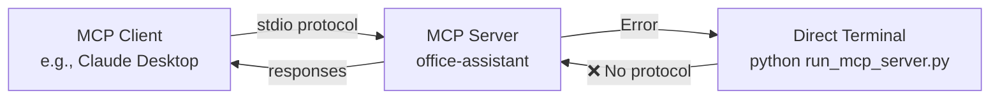

# MCP Server Setup Guide

## Understanding the Error

The error you're seeing:
```
Failed to run server: ExceptionGroup: unhandled errors in a TaskGroup (1 sub-exception)
This typically means the server is being run directly instead of through an MCP client
```

This occurs because **MCP servers cannot be run directly from the terminal**. They are designed to communicate via stdio (standard input/output) with an MCP client.

## How MCP Servers Work



## Correct Setup Process

### 1. Install Dependencies

First, ensure all dependencies are installed:

```bash
# Create virtual environment (recommended)
python3 -m venv .venv
source .venv/bin/activate  # On Windows: .venv\Scripts\activate

# Install dependencies
pip install -r requirements.txt
```

### 2. Configure Environment

Copy and configure the environment file:

```bash
cp .env.example .env
# Edit .env and add your API keys
```

### 3. Configure MCP Client

You need to configure your MCP client (e.g., Claude Desktop) to use this server.

#### For Claude Desktop

1. Find your Claude Desktop configuration file:
   - **macOS**: `~/Library/Application Support/Claude/claude_desktop_config.json`
   - **Windows**: `%APPDATA%\Claude\claude_desktop_config.json`
   - **Linux**: `~/.config/claude/claude_desktop_config.json`

2. Add the server configuration:

```json
{
  "mcpServers": {
    "office-assistant": {
      "command": "python3",
      "args": ["/home/ubuntu/Projects/MCPServer/run_mcp_server.py"],
      "env": {
        "PYTHONPATH": "/home/ubuntu/Projects/MCPServer"
      }
    }
  }
}
```

**Important**: Adjust the path to match your actual installation directory.

If using a virtual environment:
```json
{
  "mcpServers": {
    "office-assistant": {
      "command": "/home/ubuntu/Projects/MCPServer/.venv/bin/python",
      "args": ["/home/ubuntu/Projects/MCPServer/run_mcp_server.py"],
      "env": {
        "PYTHONPATH": "/home/ubuntu/Projects/MCPServer"
      }
    }
  }
}
```

### 4. Restart Claude Desktop

After configuring, restart Claude Desktop completely:
1. Quit Claude Desktop
2. Start it again
3. The MCP server should now be available

## Testing the Setup

### Option 1: Use the Diagnostics Script

```bash
python3 test_mcp_diagnostics.py
```

This will check:
- Dependencies installation
- Environment variables
- MCP client configuration
- Python version compatibility

### Option 2: Check Claude Desktop

In Claude Desktop, you should see the office-assistant tools available when you start a new conversation.

## Common Issues

### 1. Server Not Appearing in Claude

- Ensure the configuration file is valid JSON
- Check the paths are absolute and correct
- Restart Claude Desktop completely

### 2. Dependencies Not Found

If the server can't find dependencies when run by Claude:
- Use the full path to your virtual environment's Python
- Set PYTHONPATH in the env section

### 3. Permission Errors

Ensure the script is executable:
```bash
chmod +x run_mcp_server.py
```

## What NOT to Do

❌ **Don't run directly**: `python3 run_mcp_server.py`
❌ **Don't test with curl or HTTP requests** - MCP uses stdio, not HTTP
❌ **Don't expect terminal output** - Output goes to the MCP client

## Need Help?

1. Check the logs in Claude Desktop's developer console
2. Run the diagnostics script
3. Ensure all environment variables are set
4. Verify Python version is 3.10 or higher

Remember: MCP servers are meant to be launched and managed by MCP clients, not run standalone!