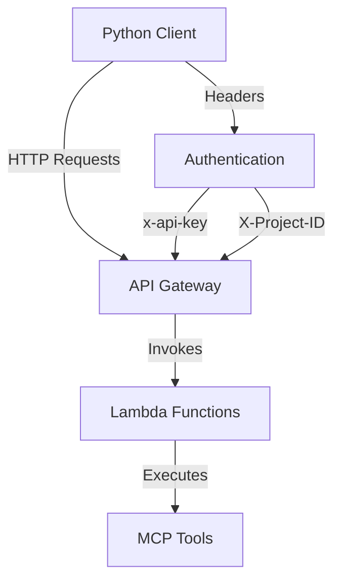
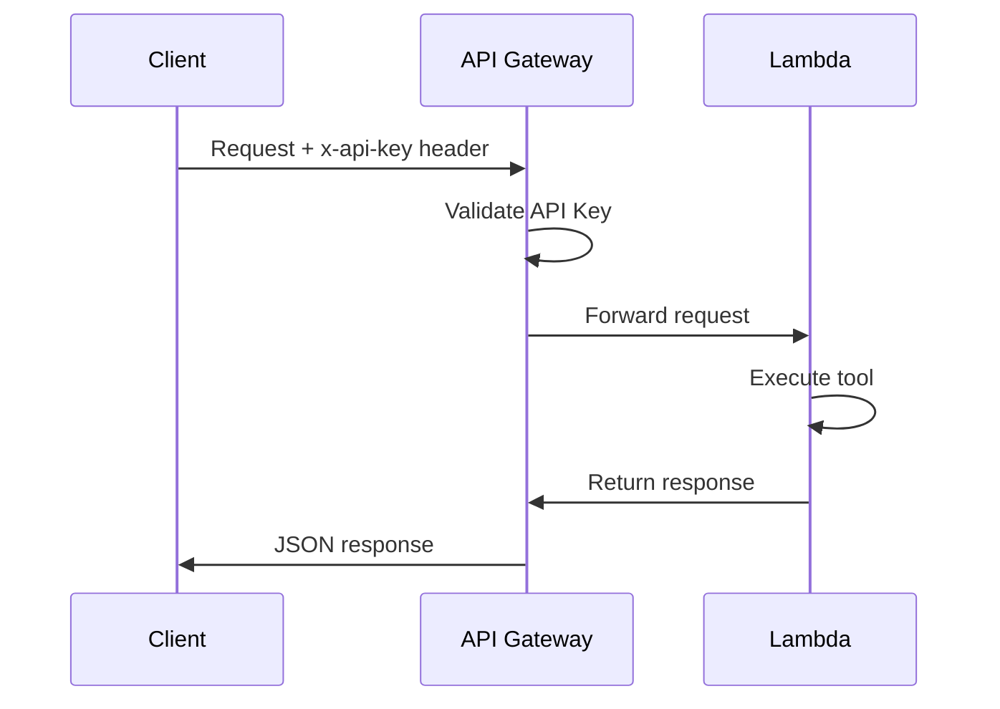

# MCP API Client Usage Guide

## Overview

The `client.py` file is a **Python API client example** that demonstrates how to interact with the deployed MCP (Model Context Protocol) Office Assistant API. This guide explains its purpose, architecture, and usage patterns.

## 🎯 Purpose

The client provides a convenient way to:
1. **Test the deployed API** after AWS deployment
2. **Demonstrate API usage patterns** for developers
3. **Provide a reference implementation** for building custom clients

## 🏗️ Architecture



## 📦 Main Components

### 1. MCPClient Class

The core class that:
- Handles API authentication with API keys
- Manages HTTP requests to the API Gateway
- Provides convenience methods for each tool
- Supports multi-tenant usage with project IDs

### 2. Available Tool Methods

| Method | Purpose | Example Usage |
|--------|---------|---------------|
| `get_weather()` | Weather data retrieval | `client.get_weather("London")` |
| `google_search()` | Web search functionality | `client.google_search("OpenAI GPT-4")` |
| `browse_urls()` | Web content extraction | `client.browse_urls(["https://example.com"])` |
| `search_amazon()` | Product search | `client.search_amazon("wireless headphones")` |
| `solve_math()` | Mathematical computations | `client.solve_math("import math; area = math.pi * 5**2")` |
| `get_embedding()` | Text embeddings | `client.get_embedding("Sample text")` |
| `create_pdf()` | PDF generation | `client.create_pdf(text, chat_id, title)` |
| `shorten_url()` | URL shortening | `client.shorten_url("https://example.com")` |
| `ask_openai()` | OpenAI reasoning | `client.ask_openai("Complex question")` |

## 🚀 Usage Modes

### 1. Demo Mode (Default)

Run predefined examples to see the client in action:

```bash
python aws-deployment/examples/client.py
```

This mode:
- Runs through various tool examples
- Shows proper response handling
- Demonstrates error handling patterns

### 2. Interactive Mode

Test tools interactively via command line:

```bash
python aws-deployment/examples/client.py --interactive
```

Available commands in interactive mode:
- `list` - List all available tools
- `weather <location>` - Get weather data
- `search <query>` - Perform Google search
- `amazon <query>` - Search Amazon products
- `math <code>` - Execute mathematical code
- `custom <tool_name> <json_args>` - Execute any tool with custom arguments
- `quit` - Exit interactive mode

## 🔧 Configuration

Before using the client, update these values in the `main()` function:

```python
# Configuration - replace with your actual values
API_URL = "https://your-api-id.execute-api.us-west-2.amazonaws.com/dev"
API_KEY = "your-api-key-here"
PROJECT_ID = "project-a"  # Optional for multi-tenant setup
```

### Where to Find These Values

1. **API_URL**: Found in CloudFormation outputs after deployment
2. **API_KEY**: Created in API Gateway console or CloudFormation outputs
3. **PROJECT_ID**: Optional identifier for multi-tenant isolation

## 📋 Example Workflows

### Basic Usage Example

```python
from client import MCPClient

# Initialize client
client = MCPClient(API_URL, API_KEY, PROJECT_ID)

# List available tools
tools_response = client.list_tools()
print(f"Available tools: {len(tools_response['tools'])}")

# Get weather data
weather = client.get_weather("London")
if weather.get("status") == "success":
    print(f"Weather data: {weather['data']}")

# Perform a search
results = client.google_search("OpenAI GPT-4", after="2024-01-01")
if results.get("status") == "success":
    print(f"Found {len(results['data']['content'])} results")
```

### Advanced Usage Example

```python
# Mathematical calculation with parameters
math_code = """
import numpy as np
data = np.array([1, 2, 3, 4, 5])
mean = np.mean(data)
std = np.std(data)
result = f"Mean: {mean}, Std: {std}"
"""
math_result = client.solve_math(math_code)

# Custom tool execution
custom_response = client.execute_tool(
    "custom_tool_name",
    param1="value1",
    param2="value2",
    nested_param={"key": "value"}
)
```

## 🔐 Authentication Flow



## 💡 Key Features

### 1. Error Handling

The client includes comprehensive error handling:

```python
try:
    response = requests.post(url, headers=self.headers, json=kwargs)
    response.raise_for_status()
    return response.json()
except requests.RequestException as e:
    return {"error": f"Failed to execute tool {tool_name}: {str(e)}"}
```

### 2. Multi-tenant Support

Use project IDs for tenant isolation:

```python
client = MCPClient(api_url, api_key, project_id="tenant-123")
```

### 3. Flexible Tool Execution

Generic method for any tool:

```python
response = client.execute_tool("any_tool_name", **tool_parameters)
```

## 📝 Response Format

All API responses follow this consistent structure:

```json
{
    "status": "success" | "error",
    "data": {
        // Tool-specific response data
    },
    "error": "Error message if status is error"
}
```

### Success Response Example

```json
{
    "status": "success",
    "data": {
        "temperature": "15°C",
        "humidity": "65%",
        "conditions": "Partly cloudy"
    }
}
```

### Error Response Example

```json
{
    "status": "error",
    "error": "Failed to fetch weather data: Invalid location"
}
```

## 🛠️ Use Cases

### 1. Post-deployment Testing

Verify your AWS deployment:

```bash
# Test basic connectivity
python client.py

# Test specific tools interactively
python client.py --interactive
```

### 2. Integration Development

Use as a reference for building applications:

```python
# Your application
from mcp_client import MCPClient

class MyApp:
    def __init__(self):
        self.mcp = MCPClient(api_url, api_key)
    
    def process_data(self, query):
        # Use MCP tools in your workflow
        search_results = self.mcp.google_search(query)
        # Process results...
```

### 3. API Documentation

The client serves as living documentation showing:
- Available endpoints
- Required parameters
- Response formats
- Authentication methods

### 4. Debugging and Troubleshooting

Test individual tools with specific parameters:

```python
# Debug a specific tool
response = client.execute_tool(
    "problematic_tool",
    debug=True,
    verbose=True,
    test_param="test_value"
)
print(json.dumps(response, indent=2))
```

## 🚨 Common Issues and Solutions

### Authentication Errors

```python
# Error: {"error": "Forbidden"}
# Solution: Check your API key is correct and active
```

### Connection Errors

```python
# Error: "Failed to execute tool: Connection refused"
# Solution: Verify API_URL is correct and includes https://
```

### Tool Not Found

```python
# Error: {"error": "Tool not found: tool_name"}
# Solution: Use list_tools() to see available tools
```

## 📚 Best Practices

1. **Always handle errors gracefully**
   ```python
   response = client.get_weather("London")
   if response.get("status") == "error":
       logger.error(f"Weather API error: {response.get('error')}")
       # Handle error appropriately
   ```

2. **Use environment variables for configuration**
   ```python
   import os
   API_URL = os.getenv("MCP_API_URL")
   API_KEY = os.getenv("MCP_API_KEY")
   ```

3. **Implement retry logic for production**
   ```python
   from tenacity import retry, stop_after_attempt, wait_exponential
   
   @retry(stop=stop_after_attempt(3), wait=wait_exponential())
   def reliable_tool_call(client, tool_name, **kwargs):
       return client.execute_tool(tool_name, **kwargs)
   ```

4. **Log requests for debugging**
   ```python
   import logging
   logging.basicConfig(level=logging.DEBUG)
   ```

## 🔗 Related Documentation

- [AWS Deployment Guide](../aws-deployment/AWS_DEPLOYMENT_GUIDE.md)
- [API Reference](./API_REFERENCE.md)
- [Troubleshooting Guide](./TROUBLESHOOTING.md)
- [Integration Guide](../integration_guide.md)

## 📞 Support

For issues or questions:
1. Check the troubleshooting section above
2. Review CloudWatch logs for Lambda errors
3. Verify API Gateway configuration
4. Ensure all environment variables are set correctly

This client serves as both a testing tool and a blueprint for building production applications that integrate with the MCP Office Assistant API.